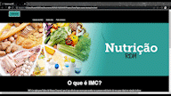
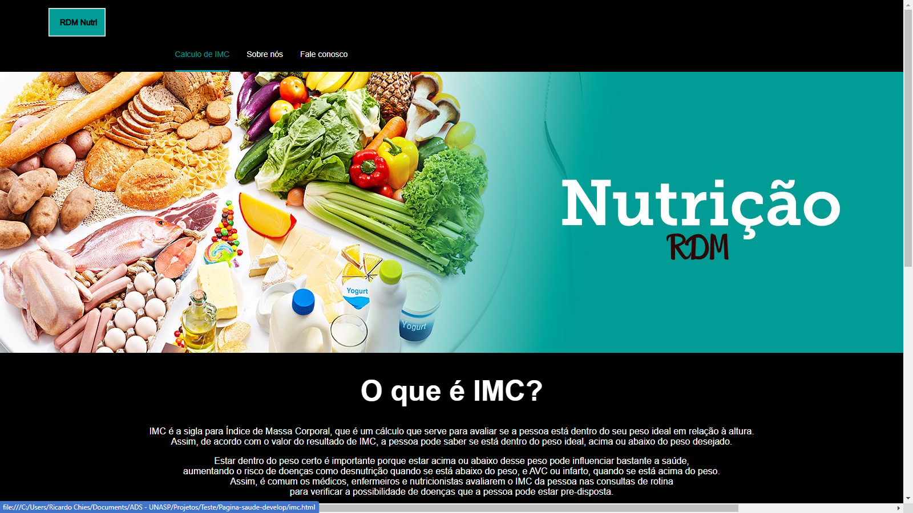
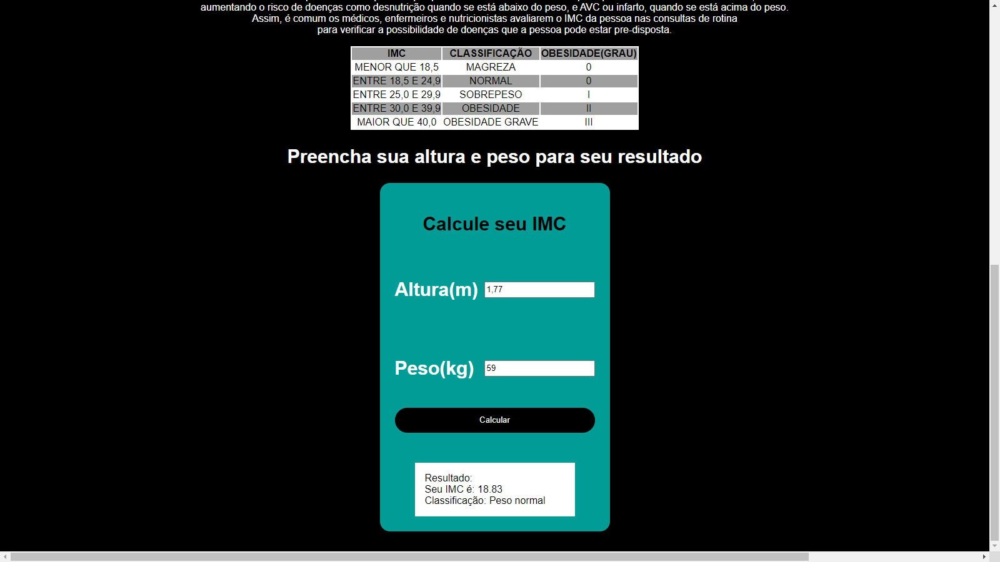
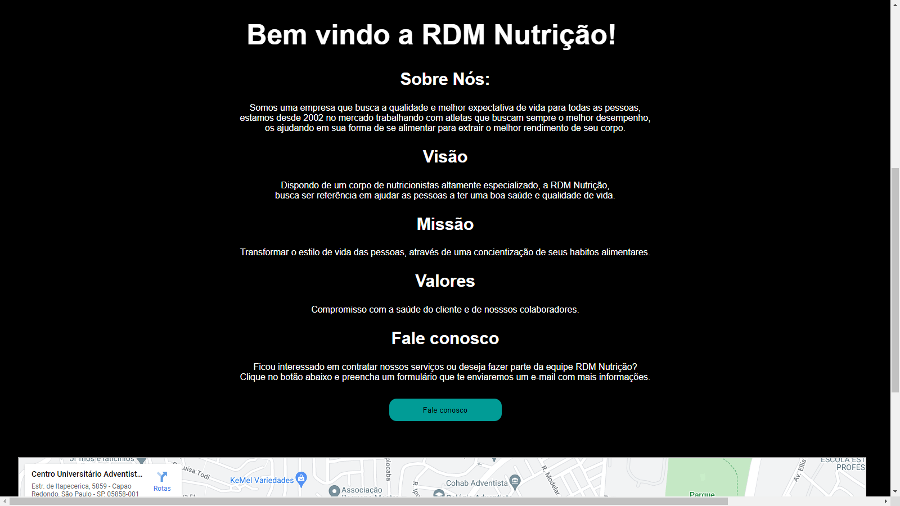
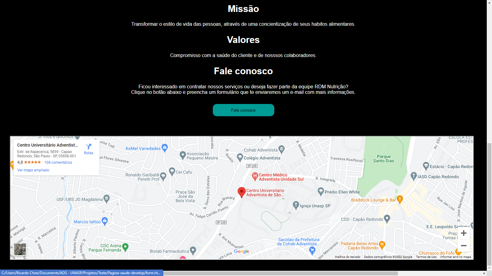
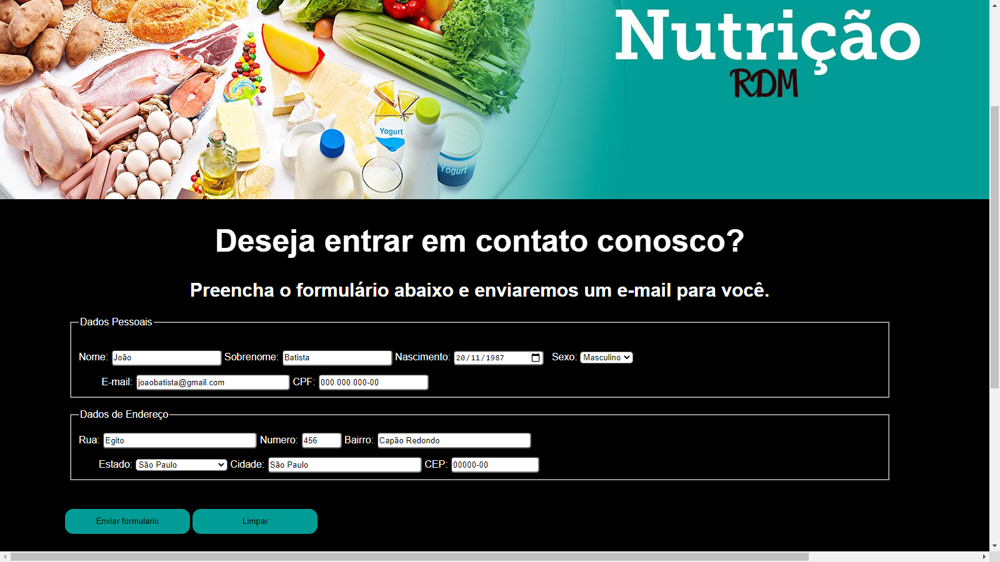
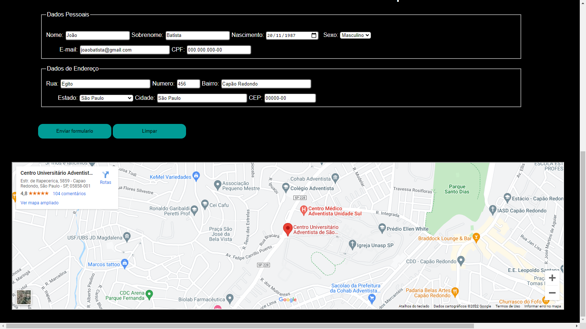

# RDM Nutrição

# Descrição
Criação de uma página de saúde em HTML e CSS

A Página contém:
<ul>
  <li>Menu;</li>
  <li>Título;</li>
  <li>Banner;</li>
  <li>Logo da empresa criado com SVG;</li>
  <li>Formulário de cadastro;</li>
  <li>Validação de CPF inserido;</li>
  <li>Ter uma tabela de IMC com classificação;</li>
  <li>Realização de cálculo de IMC, onde o usuário informa o peso e altura, então a página informa o IMC e a classificação do IMC;</li>
  <li>Visão, missão e os valores empresa. Cada grupo um em sua respectiva div;</li>
  <li>Mapa do Google com o endereço da empresa;</li>
  </ul>
  
# Layout do Projeto

  

  
  
  
  
  
  

# Tecnologias Utilizadas
<ul>
  <li>HTML</li>
  <li>CSS</li>
  <li>JavaScript</li>
  </ul>
  
# Autores

<strong>Danilo de Souza Rufino</strong>  
LinkedIn: https://www.linkedin.com/in/danilo-rufino-202b02214/  
E-mail: desouzafino@gmail.com  

<strong>José Ricardo Chies Gonçalves</strong>  
LinkedIn: https://www.linkedin.com/in/ricardo-chies-087557216/  
E-mail: ricardochies5@gmail.com  

<strong>Mateus Franklin Neco</strong>  
LinkedIn: https://www.linkedin.com/in/mateus-franklin-3049941a2/  
E-mail: matfranklin@outlook.com  
